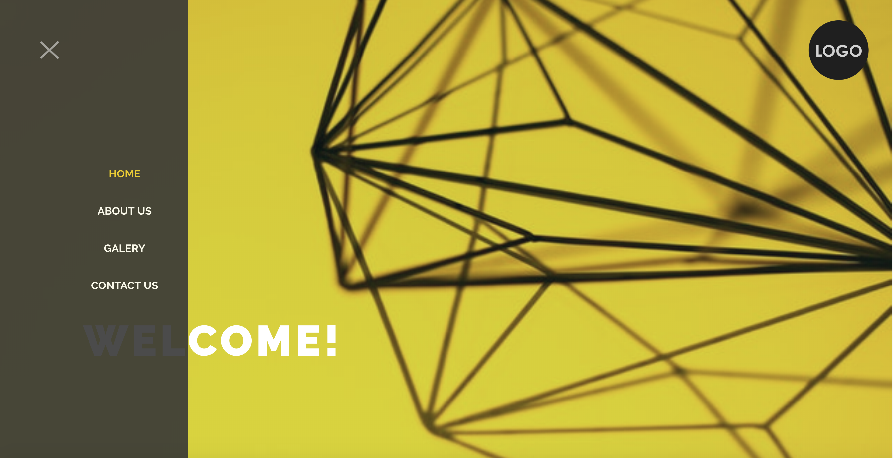
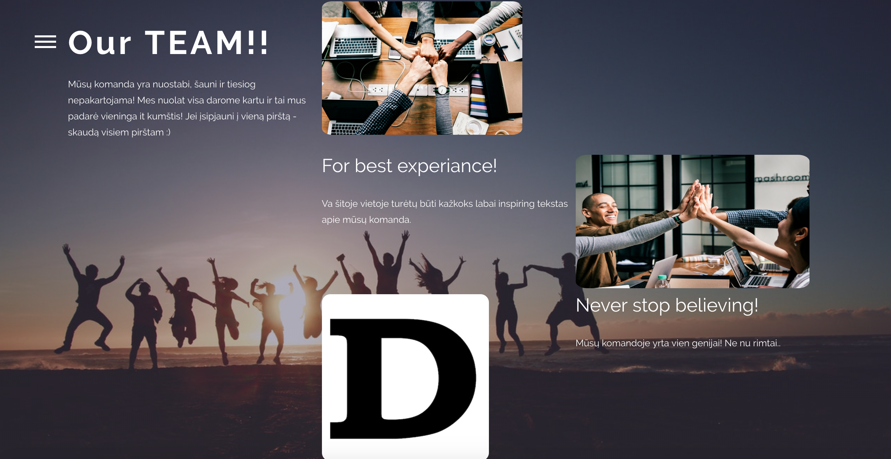
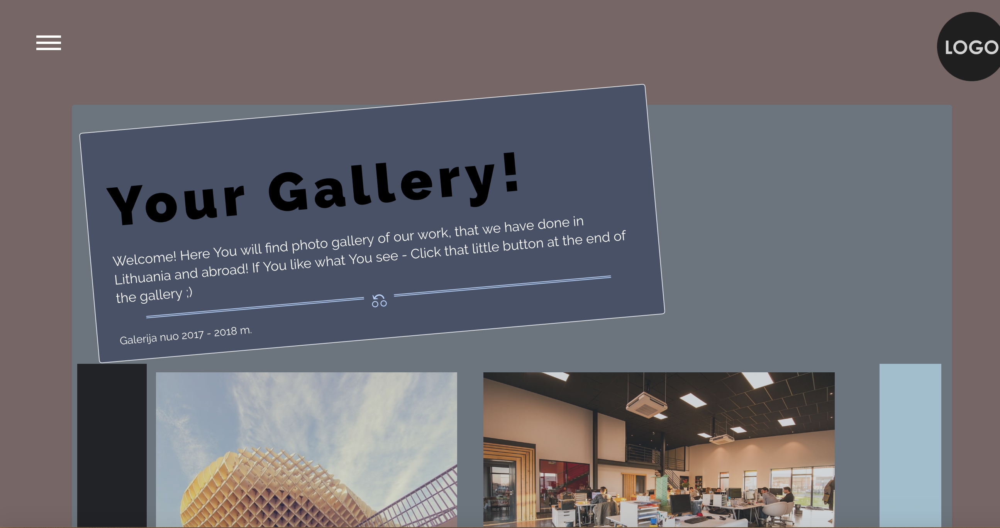
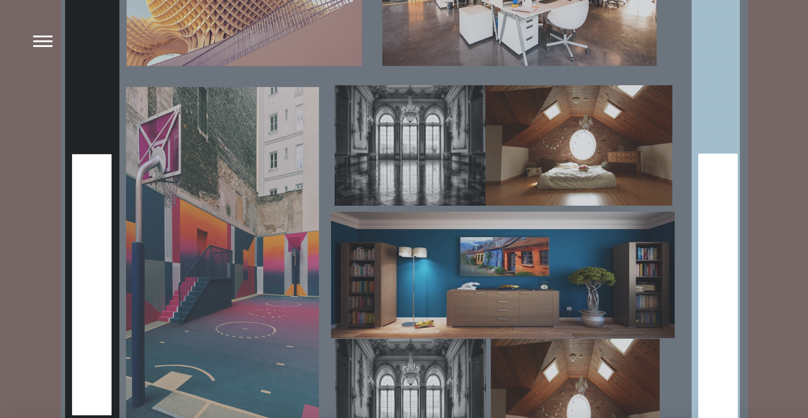
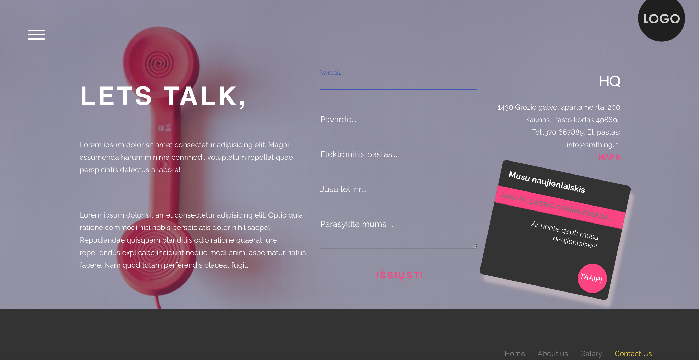

# projektas_u

Representative Landing webpage. Fully responsive. It was made as my final project in Kaunas coding school, web bootcamp course.
This project was evaluated as one of the best projects.

# What Have I learned:

- css slider;
- scss;
- css animation;
- some JS efects;
- Basics of PHP ( php include, requests, registration and login, php sesion, CRUD and more);
- Basics of Ajax;
- Basics of PHP my admin;
- sql scripts and much more.

# Quick look at the app:

Unfortunately, Github pages doesnt support php, so live version doesnt work.

